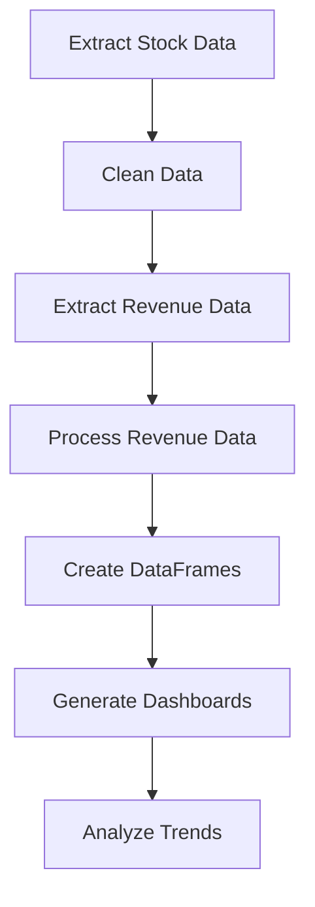

# 📈 Stock Revenue Dashboard Analysis

## Overview

This project analyzes historical stock prices and revenue data for Tesla and GameStop using Python.

The project demonstrates financial data extraction, web scraping, data cleaning, and dashboard visualization techniques using real-world datasets.

---

## Objectives

- Extract Tesla stock data using yFinance
- Extract Tesla revenue data using web scraping
- Extract GameStop stock data using yFinance
- Extract GameStop revenue data using web scraping
- Clean and preprocess financial datasets
- Build interactive dashboards using Plotly

---

## Technologies Used

- Python
- Pandas
- yFinance
- Requests
- BeautifulSoup
- Plotly
- Jupyter Notebook

---

## Project Workflow



---

## Companies Analyzed

### Tesla (TSLA)

- Historical stock performance
- Revenue growth analysis

### GameStop (GME)

- Historical stock performance
- Revenue trend analysis

---

## Key Skills Demonstrated

- Financial Data Analysis
- Data Cleaning
- Web Scraping
- API Integration
- Data Visualization
- Exploratory Data Analysis

---

## Repository Contents

```text
stock-revenue-dashboard-analysis/
│
├── Revenue Data and Building a Dashboard-v1.ipynb
└── README.md
```

---

## How to Run

Install required packages:

```bash
pip install pandas yfinance requests beautifulsoup4 plotly html5lib lxml
```

Open:

```text
Revenue Data and Building a Dashboard-v1.ipynb
```

Run all cells in sequence.

---

## Learning Outcomes

Through this project I learned:

- Stock market data extraction using APIs
- Revenue data extraction through web scraping
- Financial data preprocessing
- Interactive dashboard creation
- Business insight generation

---

## Author

**Jaswanth Reddy Bandi**

---
